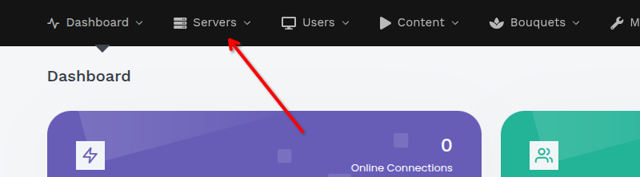
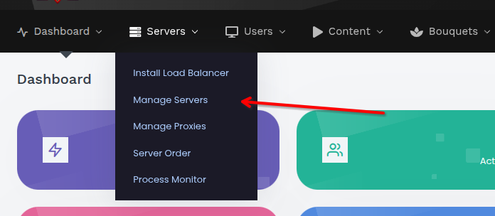
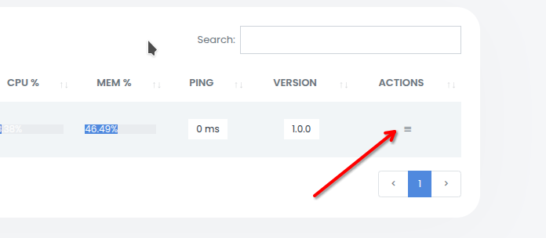
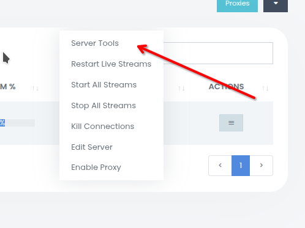
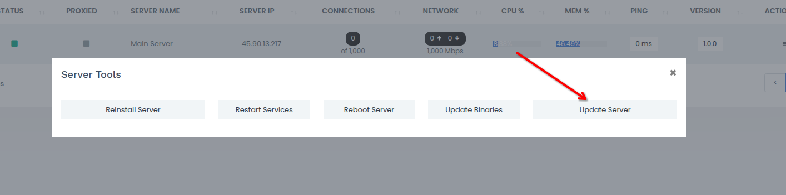

# Updating a Server

Step-by-step guide to updating an XC_VM server. For the internals of the update process, see [Update Mechanism](../administration/update-system.md).

> 💾 MAIN dumps its database to `/home/xc_vm/backups/pre_update_<from>_to_<to>_<timestamp>.sql` before the update's migrations run, when the disk has room for it. A [backup](../administration/backup-strategy.md) of your own before updating is still recommended.

## Updating via the Panel

**Step 1.** Open the **Servers** section in the top menu of the panel.



**Step 2.** Select **Manage Servers** from the dropdown menu.



**Step 3.** Locate the target server in the servers table and click the menu button in the **Actions** column.



**Step 4.** Select **Server Tools** from the menu.



**Step 5.** In the **Server Tools** dialog, click **Update Server**.



Clicking the button inserts an `update` signal into the database. Within a minute, CRON picks it up and the update runs automatically: the panel is stopped, updated, and restarted. You can track progress via the server version in the **Manage Servers** table.

## Updating Every Load Balancer: Rolling Update

**Servers → Bulk → Update All Servers** sends the update to every server at once, so every load
balancer restarts at the same time. **Servers → Bulk → Rolling Update** updates them **one at a
time** instead, to MAIN's release:

1. Update MAIN first.
2. Click **Rolling Update** and confirm. The load balancers that are online and not on MAIN's
   release are updated in turn, by server ID.
3. Each one must be back online on MAIN's release within 20 minutes, and stay online for a minute,
   before the next one starts. A load balancer that does not stops the rolling update: the ones
   after it are left as they are, and the page says what happened.

A card above the servers table shows each load balancer's progress. **Cancel** stops the update
before the next load balancer; the one updating at that moment finishes by itself. Proxies run their
own release and are not part of it. From the command line on MAIN:

```bash
sudo -u xc_vm /home/xc_vm/console.php cluster:rolling-update
```

## Manual Update (CLI)

```bash
sudo -u xc_vm /home/xc_vm/console.php update update
```

Downloads and applies the latest update from GitHub. Usually triggered automatically through the web panel.

## Update Channels

**Settings → General → Updates** sets the release channel for each component. The panel channel also applies to every load balancer.

| Channel | Panel receives |
|---------|----------------|
| `Stable` | Stable releases only |
| `Beta` | Stable releases and pre-releases |
| `Dev (nightly)` | Everything in `Beta`, plus nightly builds of the `main` branch (`X.Y.Z-dev.N`) |

`Dev` is offered for the panel only. Nightly builds are published to the separate [XC_VM_Dev](https://github.com/Vateron-Media/XC_VM_Dev/releases) repository, at most once a day and only when `main` has changed.

> ⚠️ Nightly builds are untested. Use `Dev` on test servers only: a nightly may apply a database migration that a later build revises.

To leave `Dev`, switch the channel back to `Stable`. A nightly `X.Y.Z-dev.N` is older than the release `X.Y.Z`, so the panel updates to that release as soon as it is published. To return to the previous release right away, use a [rollback](#rolling-back-a-server). Nightly builds are never offered as rollback targets.

## Rolling Back a Server

If an update introduces a problem, you can roll a server back to an earlier release directly from the panel. Rollback works per-server, so both the **MAIN** panel and individual **Load Balancers** can be downgraded independently.

**Step 1.** Open the **Servers** section → **Manage Servers**.

**Step 2.** Locate the target server and open its **Actions** menu (the same menu used for updating).

**Step 3.** Click **Rollback Version**. A dialog opens listing earlier releases (newest first). Pre-release builds are tagged `(beta)`.

**Step 4.** Select the version to roll back to and confirm.

Clicking **Rollback** inserts a `rollback` signal (carrying the chosen version) into the database. Within a minute CRON picks it up and the rollback runs automatically, reusing the same stop → replace → restart flow as an update. Track progress via the server version in the **Manage Servers** table.

> 💾 On the **MAIN** server a database backup is taken automatically before the rollback, saved to `/home/xc_vm/backups/pre_rollback_<from>_to_<to>_<timestamp>.sql`. Load balancers have no database, so this step is skipped.

The versions offered depend on the server's update channel: on the `stable` channel only stable releases are listed; on `beta` and `dev` you also see `(beta)` pre-releases.

> ⚠️ A rollback to 2.6.0 or later **does not undo database migrations**; one to 2.5.3 or earlier reverses those that ship a reverse file. The schema is designed to stay backward-compatible, and the automatic backup is the recovery path if an older build cannot read newer data. Use rollback only as a recovery step.

### Manual Rollback (CLI)

```bash
sudo -u xc_vm /home/xc_vm/console.php update rollback 2.4.0
```

Downloads the specified release from GitHub and applies it, with the same integrity checks and — on MAIN — the automatic database backup.
