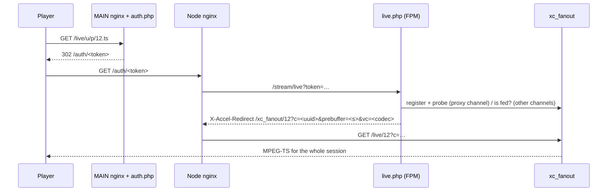

# MPEG-TS Delivery

How a live MPEG-TS viewer is served, from the player's first request to the
end of its session, and which parts PHP and `xc_fanout` (Go) each own. HLS
is covered in [Streaming Subsystem](streaming-subsystem.md) and its segment
gateway in ADR 0005.

## Overview

A TS session takes two HTTP requests. Only the first is a PHP decision:

1. **MAIN** (`/live/<user>/<pass>/<id>.ts` and the other forms, `auth.php`) authenticates the line, picks the server and mints a token.
2. **The serving node** (`/auth/<token>`, `live.php`) admits the viewer, records the connection and hands the byte path to the daemon. With fanout on, the PHP-FPM worker is free once it has answered.
3. **`xc_fanout`** (`/live/<id>` on its client socket) streams the TS from its in-memory ring for the whole session.

## 1. MAIN: `auth.php`

nginx turns every live URL form (`/live/u/p/12.ts`, `/u/p/12`, `/play/<token>`, …) into `/stream/auth?…&type=live`.

- **Checks**: the cache is complete, the node lease accepts new sessions, the credentials or HMAC, auth flood, the line's state (expired, banned, disabled), user agent, allowed IPs and countries, ISP and ASN, the device, restream detection, the allowed extension and the bouquet.
- **Server choice**: `StreamRedirector::redirectStream()` picks the server (`redirect_id`, and `originator_id` behind a proxy server); `getStreamingURL()` gives its base URL.
- **`case 'ts'`**: `disable_ts` (with `disable_ts_allow_restream`) refuses TS. The token holds the stream, the line (username and password) or HMAC identity, `extension: ts`, `channel_info` (`redirect_id`, `originator_id`, `pid`, `on_demand`, `llod`, `monitor_pid`, `proxy` = the stream's `direct_proxy`), `user_info` (id, `max_connections`, `pair_id`, `con_isp_name`, `is_restreamer`), `prebuffer`, `country_code`, `activity_start`, `external_device`, `video_codec` and `uuid`.
- `ConnectionAdmission::admitToken()` reserves the viewer's place (the token's `uuid`); `ViewerKey::mint()` seals the token for the serving node.
- The answer is `302 <server>/auth/<token>` (`/auth/<id>.ts?token=<token>` with `allow_cdn_access`).

## 2. The node: `live.php`

nginx rewrites `/auth/<token>` to `/stream/live?token=<token>`. `StreamingRequestBootstrap` runs first (flood block, `verify_host`), then `live.php`. Each step below refuses with `generateError()` or the not-on-air video (`OffAirHandler::showNotOnAir()`).

### 2.1 The token

- `StreamAuthMiddleware::decryptToken()` opens it. A `video_path` or `off_air` token gets that video file and stops.
- An extension other than `ts` or `m3u8` becomes `api_container`. A proxy channel accepts only `ts` (`USER_DISALLOW_EXT`).
- `use_buffer = 0` sends `X-Accel-Buffering: no`.
- The serving server is `originator_id` (with `redirect_id` as the proxy in front of it) or `redirect_id`, else this server.

### 2.2 The producer

- **Proxy channel, fanout on** (`FanoutMode::legacyDelivery()` false and `LicenseGate::fanoutUsable()`): the stream's source is read from the database (`StreamSource::sourceRow()`, `arguments()`), `FanoutClient::buildSource()` turns it into the daemon's form, and `FanoutClient::register()` sends it to the daemon. This is the only place a proxy channel's source reaches the daemon, so an edited source takes effect at the next viewer's request. `FanoutClient::probe()` then waits up to `on_demand_wait_time` for data; none means not-on-air.
- The `_.pid` and `_.monitor` files update `channel_info`. `on_demand_instant_off` queues this worker for the on-demand channel (`ConnectionTracker::addToQueue()`; the shutdown handler removes it).
- **No live producer** (and not a registered proxy channel): `FanoutMode::startFor()` decides.
    - `START_PROXY` (fanout off): one `ProxyCommand` per stream, started under `StreamProcess::lockOnDemandStart()`.
    - `START_MONITOR` (on-demand): starts the monitor (or the fanout supervisor), then waits `on_demand_wait_time` for `_.pid`.
    - Otherwise: not-on-air.
- **Non-proxy channel**: for TS it waits for `_.m3u8`, or `_0.ts`/`_0.m4s` (up to `on_demand_wait_time`, `WAIT_TIME_EXPIRED`), and checks that the stream is still watched and alive.

### 2.3 Admission and the connection

- **`disallow_2nd_ip_con`** (not a restreamer, and `max_connections` within `disallow_2nd_ip_max`, or the maximum at 0): the line's other address (`ConnectionTracker::acceptedIP()`) gets the connected video.
- **The uuid**: TS keeps the token's `uuid`. HLS replaces it with `hlsConnectionKey()` (one record per player).
- **The delivery** (`FanoutMode::tsDelivery()`): the daemon for a proxy channel that registered and probed, or a non-proxy channel the daemon is fed with (`FanoutClient::isStreamFed()`, `has_data`); the legacy feed when fanout is off. The connection's `pid` is 0 for the daemon (no worker serves it) and this worker's pid for the legacy feed.
- **`ConnectionTracker::lookupLive($ctx, 'ts', withPid, openOnly = false)`**, in the node's agent (CONNECTIONS), else Redis or `lines_live`:
    - none: the token's `activity_start + create_expiration` must not have passed (`TOKEN_EXPIRED`), then `createLive()`;
    - found, ended or not (TS re-opens an ended connection): `restrict_same_ip` (`IP_MISMATCH`); a php-fpm worker still feeding it is killed; `updateLive()` writes the `pid` and `hls_last_read` and re-opens it.
- A failed write: `StreamAuth::refuseAdmission()`, `LINE_CREATE_FAIL`.
- `StreamAuth::validateConnections()`: on a CONNECTIONS node, `conn.limit` spooled for MAIN (lane `p0`); else the line's limit enforced here (`ConnectionLimiter`).
- The database or Redis is closed. For the legacy feed only, `$rCloseCon` is set (the shutdown handler closes the connection) and the viewer's marker `CONS_TMP_PATH/<uuid>` touched. A daemon viewer gets neither: its record outlives the worker (section 4), and nothing reads a TS viewer's marker.

### 2.4 The bytes

| Channel | Fanout | What answers |
| --- | --- | --- |
| proxy | on | `X-Accel-Redirect: /xc_fanout/<id>?c=<uuid>&prebuffer=<s>&vc=<codec>`; the worker returns |
| proxy | off | the worker relays `ProxyCommand`'s datagrams from `CONS_TMP_PATH/<id>/<uuid>` to the viewer, for the whole session |
| non-proxy | on, fed | the same `X-Accel-Redirect` |
| non-proxy | on, not fed | not-on-air |
| non-proxy | off | the worker chase-reads the on-disk segments (`SegmentReader`), with the send-message signal (`SIGNALS_PATH/<uuid>`) and the divergence file, for the whole session |

`prebuffer` is the seconds of history the daemon sends on join: `client_prebuffer`; for a restreamer `restreamer_prebuffer`, or `max(1, seg_time)` when its link asks for a prebuffer.

nginx's `location ^~ /xc_fanout/` (internal) rewrites the target to `/live/<id>` on the daemon's client socket `bin/xc_fanout/sockets/http.sock`, with buffering off and a one-hour read timeout.

### 2.5 After the answer: `ShutdownHandler::handle('live')`

- `$rCloseCon` set (the legacy feed): it closes the connection whose `pid` is this worker's (`hls_end = 1`) in the agent, Redis or `lines_live`, and deletes the marker `CONS_TMP_PATH/<uuid>` and the legacy relay's socket file. A daemon viewer skips this step: it had nothing to close (its `pid` is 0) and cost an agent round-trip, or a database reconnect and an UPDATE matching no row, per session.
- Instant off: the worker leaves the on-demand queue.

## 3. The daemon: `xc_fanout`'s `/live/<id>`

`Manager.serveLive` (`internal/server/server.go`):

- attaches the viewer to the stream (starting a stopped puller), joins the ring `prebuffer` seconds back on a keyframe;
- counts the viewer under `c` (the uuid), which `/connections` lists for the panel;
- writes with a per-write deadline (`write_timeout_sec`), drops a viewer that got nothing for `viewer_idle_timeout_sec`, and sends a pending send-message overlay (`vc` is the codec it is drawn with).

## 4. The session's end

The viewer's record stays open after PHP has answered (`pid` 0). The record is closed by whichever holds the node's viewers:

- **The agent** (CONNECTIONS): it reconciles its registry against the daemon's `/connections` itself.
- **Otherwise** `fanout_sync` (`FanoutSyncCommand`): it closes the open `pid = 0` rows the daemon no longer lists (after a short grace for the connect race), ends daemon viewers with no open row (`dropOrphans()`), and writes the per-viewer rates and divergence.

## 5. The segment gateway (TS reconnect)

With `gateway_mode = segments+playlist`, nginx sends `/auth/<token>` to the gateway in `xc_fanout` first. A known TS viewer that asks again with the same token is answered there, without PHP, as section 2 would answer it: the gateway checks the token and the connection, re-opens the record in the agent with `pid` 0, spools `conn.limit` (no marker, as above), and streams from the daemon's `/live/<id>` in-process. Everything else, including each session's first request and every proxy channel (whose source only `live.php` registers), goes to `live.php`. See ADR 0005, "MPEG-TS reconnects".
