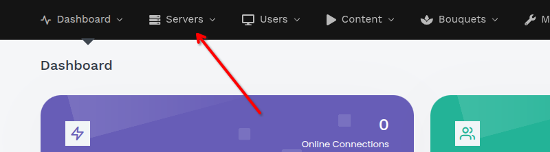
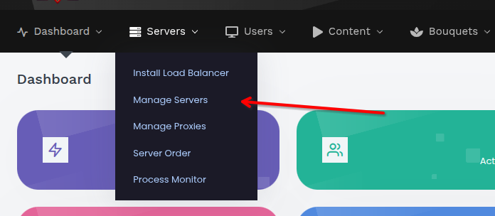
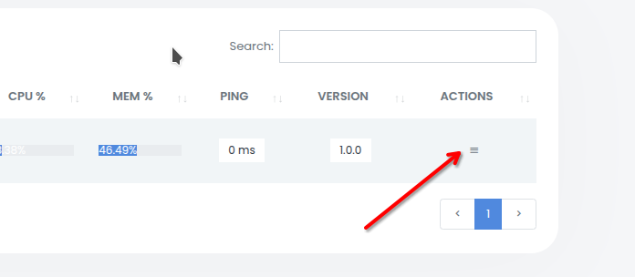
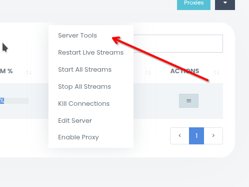
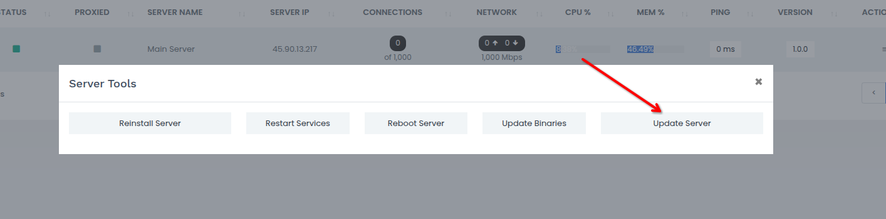

# Обновление сервера

Пошаговое руководство по обновлению сервера XC_VM. Более подробную информацию о процессе обновления смотрите в разделе [Механизм обновления](../administration/update-system.md).

> 💾 Перед обновлением рекомендуется создать [резервную копию](../administration/backup-strategy.md).

## Обновление через панель управления

**Шаг 1.** Откройте раздел **Серверы** в верхнем меню панели.



**Шаг 2.** Выберите **Управление серверами** из выпадающего меню.



**Шаг 3.** Найдите целевой сервер в таблице серверы и нажмите кнопку меню в столбце **Действия**.



**Шаг 4.** Выберите в меню пункт **Серверные инструменты**.



**Шаг 5.** В диалоговом окне **Серверные инструменты** нажмите кнопку **Сервер обновлений**.



При нажатии на кнопку в базу данных заносится сигнал `update`. В течение минуты CRON распознает его, и обновление выполняется автоматически: панель останавливается, обновляется и перезапускается. Вы можете отслеживать прогресс с помощью версии сервера в таблице **Управление серверами**.

## Обновление вручную (CLI)

```bash
sudo -u xc_vm /home/xc_vm/console.php update update
```

Загружает и применяет последнее обновление с GitHub. Обычно запускается автоматически через веб-панель.

## Откат сервера назад

Если при обновлении возникает проблема, вы можете откатить сервер к более ранней версии непосредственно из панели. Откат выполняется для каждого сервера, поэтому как панель **главный**, так и отдельный **Балансировщики нагрузки** могут быть понижены независимо друг от друга.

**Шаг 1.** Откройте раздел **Серверы** → **Управление серверами**.

**Шаг 2.** Найдите целевой сервер и откройте его меню **Действия** (то же меню, что использовалось для обновления).

**Шаг 3.** Нажмите **Версия для отката**. Откроется диалоговое окно со списком более ранних версий (сначала самых новых). Предварительные сборки помечены тегом `(beta)`.

**Шаг 4.** Выберите версию, к которой требуется выполнить откат, и подтвердите ее.

Нажатие кнопки **Отмена** вводит сигнал `rollback` (содержащий выбранную версию) в базу данных. В течение минуты CRON распознает его, и откат выполняется автоматически, повторно используя тот же процесс остановки → замены → перезапуска в качестве обновления. Отслеживайте прогресс с помощью серверной версии в таблице **Управление серверами**.

> 💾 На сервере **главный** перед откатом автоматически создается резервная копия базы данных, которая сохраняется в `/home/xc_vm/backups/pre_rollback_<from>_to_<to>_<timestamp>.sql`. В системах балансировки нагрузки нет базы данных, поэтому этот шаг пропущен.

Предлагаемые версии зависят от канала обновления сервера: на канале `stable` отображаются только стабильные версии; на канале `unstable` вы также видите предварительные версии `(beta)`.

> ➡️ Откат **не отменяет перенос базы данных** — они доступны только в прямом режиме. Схема разработана таким образом, чтобы поддерживать обратную совместимость, а автоматическое резервное копирование - это путь восстановления, если более старая сборка не может считывать новые данные. Используйте откат только в качестве шага восстановления.

### Ручной откат (CLI)

```bash
sudo -u xc_vm /home/xc_vm/console.php update rollback 2.4.0
```

Загружает указанный релиз с GitHub и применяет его с теми же проверками целостности и — в основном — автоматическим резервным копированием базы данных.
