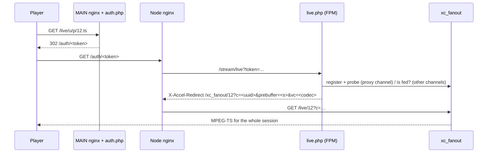

# Доставка в формате MPEG-TS

Как осуществляется просмотр MPEG-TS в режиме реального времени, начиная с первого запроса игрока и заканчивая
заканчивается его сессия, и какие части PHP и `xc_fanout` (Go) принадлежат каждой из них. HLS
рассматривается в [потоковой подсистеме](streaming-subsystem.md) и ее сегменте
шлюз в ADR 0005.

## Обзор

Сеанс TS принимает два HTTP-запроса. Только первый является решением PHP:

1. **главный** (`/live/<user>/<pass>/<id>.ts` и другие формы, `auth.php`) проверяет подлинность строки, выбирает сервер и отчеканивает токен.
2. **Обслуживающий узел** (`/auth/<token>`, `live.php`) запускает программу просмотра, записывает соединение и передает путь в байтах демону. При включенном разветвлении рабочий сервер PHP-FPM свободен, как только он ответит.
3. **`xc_fanout`** (`/live/<id>` на своем клиентском сокете) передает TS из своего кольца в памяти в течение всего сеанса.

## 1. ГЛАВНАЯ: `auth.php`

nginx преобразует каждую форму реального URL-адреса (`/live/u/p/12.ts`, `/u/p/12`, `/play/<token>`, ...) в `/stream/auth?…&type=live`.

- **Проверки**: кэш завершен, сервер аренды узла принимает новые сеансы, учетные данные или HMAC, аутентификационный поток, состояние линии (истек, запрещен, отключен), пользовательский агент, разрешенные IP-адреса и страны, провайдер и ASN, устройство, обнаружение повторного потока, разрешенный добавочный номер и набор параметров..
- **Выбор сервера**: `StreamRedirector::redirectStream()` выбирает сервер (`redirect_id` и `originator_id` за прокси-сервером); `getStreamingURL()` указывает его базовый URL.
- **`case 'ts'`**: `disable_ts` (с `disable_ts_allow_restream`) отклоняет TS. Токен содержит поток, строку (имя пользователя и пароль) или идентификатор HMAC, `extension: ts`, `channel_info` (`redirect_id`, `originator_id`, `pid`, `on_demand`, `llod`, `monitor_pid`, `proxy` = потока `direct_proxy`), `user_info` (id, `max_connections`, `pair_id`, `con_isp_name`, `is_restreamer`), `prebuffer`, `country_code`, `activity_start`, `external_device`, `video_codec` и `uuid`.
- `ConnectionAdmission::admitToken()` резервирует место для просмотра (место токена `uuid`); `ViewerKey::mint()` закрепляет токен за обслуживающим узлом.
- Ответ - `302 <server>/auth/<token>` (`/auth/<id>.ts?token=<token>` с `allow_cdn_access`).

## 2. Узел: `live.php`

nginx переписывает `/auth/<token>` на `/stream/live?token=<token>`. сначала выполняется `StreamingRequestBootstrap` (блокировка потока, `verify_host`), затем `live.php`. На каждом шаге, приведенном ниже, используется `generateError()` или видео, которое не будет показано в эфире (`OffAirHandler::showNotOnAir()`).

### 2.1 Токен

- `StreamAuthMiddleware::decryptToken()` открывает его. Токен `video_path` или `off_air` получает этот видеофайл и останавливается.
- Добавочный номер, отличный от `ts` или `m3u8`, становится `api_container`. Прокси-канал принимает только `ts` (`USER_DISALLOW_EXT`).
- `use_buffer = 0` отправляет `X-Accel-Buffering: no`.
- Обслуживающий сервер - это `originator_id` (с `redirect_id` в качестве прокси-сервера перед ним) или `redirect_id`, в противном случае это сервер.

### 2.2 Производитель

- **Прокси-канал, разветвленный на** (`FanoutMode::legacyDelivery()` false и `LicenseGate::fanoutUsable()`): источник потока считывается из базы данных (`StreamSource::sourceRow()`, `arguments()`), `FanoutClient::buildSource()` преобразует его в форму демона и `FanoutClient::register()` отправляет демону. Это единственное место, где источник прокси-канала достигает демона, поэтому отредактированный источник вступает в силу при следующем запросе зрителя. `FanoutClient::probe()` затем данные ожидаются до `on_demand_wait_time`; "нет" означает "не в эфире".
- Файлы `_.pid` и `_.monitor` обновляют `channel_info`. `on_demand_instant_off` этот рабочий файл помещается в очередь канала по требованию (`ConnectionTracker::addToQueue()`; обработчик завершения работы удаляет его).
- **No live producer** (and not a registered proxy channel): `FanoutMode::startFor()` decides.
    - `START_PROXY` (разветвление отключено): по одному `ProxyCommand` на поток, запущенный под `StreamProcess::lockOnDemandStart()`.
    - `START_MONITOR` (по требованию): запускает монитор (или диспетчер разветвления), затем ожидает `on_demand_wait_time` для `_.pid`.
    - В противном случае: не в эфире.
- **Канал, не являющийся прокси-сервером**: для TS он ожидает `_.m3u8` или `_0.ts`/`_0.m4s` (вплоть до `on_demand_wait_time`, `WAIT_TIME_EXPIRED`) и проверяет, что поток все еще просматривается и активен.

### 2.3 Допуск и подключение

- **`disallow_2nd_ip_con`** (не повторный просмотр, а `max_connections` в пределах `disallow_2nd_ip_max` или максимальное значение в 0): подключенное видео передается по другому адресу строки (`ConnectionTracker::acceptedIP()`).
- **Идентификатор uuid**: TS сохраняет значение токена `uuid`. HLS заменяет его на `hlsConnectionKey()` (по одной записи на игрока).
- **Доставка** (`FanoutMode::tsDelivery()`): демон для прокси-канала, который был зарегистрирован и протестирован, или для канала, не являющегося прокси-сервером, которым питается демон (`FanoutClient::isStreamFed()`, `has_data`); устаревший канал при отключенном разветвлении. Значение `pid` соединения равно 0 для демона (ни один рабочий не обслуживает его), а pid этого рабочего - для устаревшего канала.
- **`ConnectionTracker::lookupLive($ctx, 'ts', withPid, openOnly = false)`**, в агенте узла (СОЕДИНЕНИЯ), в противном случае Redis или `lines_live`:
    - нет: значение токена `activity_start + create_expiration` не должно было передаваться (`TOKEN_EXPIRED`), тогда `createLive()`;
    - найдено, завершено или нет (TS повторно открывает завершенное соединение): `restrict_same_ip` (`IP_MISMATCH`); рабочий php-fpm, который все еще поддерживает его, уничтожен; `updateLive()` записывает `pid` и `hls_last_read` и снова открывает его.
- Неудачная запись: `StreamAuth::refuseAdmission()`, `LINE_CREATE_FAIL`.
- `StreamAuth::validateConnections()`: на узле ПОДКЛЮЧЕНИЯ `conn.limit` загружено в очередь для ОСНОВНОГО (полоса `p0`); в противном случае здесь применяется ограничение линии (`ConnectionLimiter`).
- База данных или Redis закрыта. Только для устаревшего канала установлено значение `$rCloseCon` (обработчик завершения работы закрывает соединение) и отмечен маркер просмотра `CONS_TMP_PATH/<uuid>`. Демонический просмотрщик не получает ни того, ни другого: его запись переживает рабочего (раздел 4), и ничто не считывает маркер просмотрщика TS.

### 2.4 Байты

|Канал|Разветвление|Какие ответы|
| --- | --- | --- |
|полномочие|на|`X-Accel-Redirect: /xc_fanout/<id>?c=<uuid>&prebuffer=<s>&vc=<codec>`; рабочий возвращает|
|полномочие|прочь|рабочий передает `ProxyCommand` дейтаграмм из `CONS_TMP_PATH/<id>/<uuid>` в программу просмотра в течение всего сеанса|
|не по доверенности|включен, накормлен|тот же самый `X-Accel-Redirect`|
|не по доверенности|включен, не подается|не в эфире|
|не по доверенности|прочь|рабочий процесс выполняет повторное считывание сегментов на диске (`SegmentReader`) с сигналом отправки сообщения (`SIGNALS_PATH/<uuid>`) и файлом расхождения в течение всего сеанса|

`prebuffer` - это секунды истории, которые демон отправляет при соединении: `client_prebuffer`; для повторного потока `restreamer_prebuffer` или `max(1, seg_time)`, когда его ссылка запрашивает предварительный буфер.

параметр nginx `location ^~ /xc_fanout/` (внутренний) перезаписывает целевой объект на `/live/<id>` в клиентском сокете демона `bin/xc_fanout/sockets/http.sock` с отключением буферизации и тайм-аутом чтения в один час.

### 2.5 After the answer: `ShutdownHandler::handle('live')`

- `$rCloseCon` set (устаревший канал): он закрывает соединение, `pid` которого принадлежит этому рабочему (`hls_end = 1`) в агенте, Redis или `lines_live`, и удаляет маркер `CONS_TMP_PATH/<uuid>` и файл сокета устаревшего ретранслятора. Программа просмотра демонов пропускает этот шаг: ей нечего было закрывать (значение `pid` равно 0), и это стоило обхода агента или повторного подключения к базе данных и обновления, не соответствующего ни одной строке, за сеанс.
- Мгновенное отключение: работник покидает очередь по требованию.

## 3. Демон: `xc_fanout` `/live/<id>`

`Manager.serveLive` (`internal/server/server.go`):

- присоединяет программу просмотра к потоку (запускает остановленный съемник), присоединяется к кольцу `prebuffer` секунд назад на ключевом кадре;
- подсчитывает количество просмотров под `c` (uuid), которое `/connections` указано для панели;
- выполняет запись с предельным сроком для каждой записи (`write_timeout_sec`), удаляет программу просмотра, которая ничего не получила за `viewer_idle_timeout_sec`, и отправляет отложенное наложение сообщения об отправке (`vc` - это кодек, с помощью которого оно отрисовывается).

## 4. Окончание сеанса

Запись средства просмотра остается открытой после того, как PHP ответит (`pid` 0). Запись закрывается тем, у кого есть средства просмотра узла:

- **Агент** (СОЕДИНЕНИЯ): он сверяет свой реестр с реестром самого демона `/connections`.
- **Иначе** `fanout_sync` (`FanoutSyncCommand`): он закрывает открытые `pid = 0` строки, которые демон больше не отображает (после небольшой паузы в гонке подключений), завершает просмотр демонами без открытых строк (`dropOrphans()`) и записывает показатели для каждого просмотра и расхождения.

## 5. Сегментный шлюз

С помощью `gateway_mode = segments+playlist` nginx сначала отправляет `/auth/<token>` на шлюз в `xc_fanout`. Там он отвечает на запрос TS viewer без использования PHP, как ответил бы раздел 2:

- **Первый запрос** (пока нет записи под именем `uuid` токена): шлюз создает соединение так же, как и `createLive()`, из основного запечатанного токена. Он регистрирует запись в агенте (`container` ts, `pid` 0, начало использования токена, страна, провайдер и устройство, подтверждение подлинности MAIN) с запросом на доступ к строке с ограничением (`X-XCVM-Admission`), буферами `conn.limit` (без маркера, как указано выше), и потоки из процесса `/live/<id>` демона.
- **Повторное подключение** (снова тот же токен): он проверяет соединение, повторно открывает запись с `pid` 0, перезаписывает `conn.limit` и выполняет потоковую передачу таким же образом.

`live.php` по-прежнему отвечает, прежде чем что-либо будет записано: токен старше `create_expiration` (его `TOKEN_EXPIRED`), поток, который не запущен или не загружен (он запускает поток по требованию), каждый прокси-канал (источник которого регистрирует только `live.php`), строка под правило второго адреса и панель или демон, которые предшествовали этому правилу. После регистрации он также отвечает на запрос о просмотре, который агент отклоняет (он снова запрашивает агента и показывает отказ), и на запрос, на который агент не ответил. Смотрите ADR 0005, "Повторное подключение MPEG-TS" и "Первые запросы MPEG-TS".
