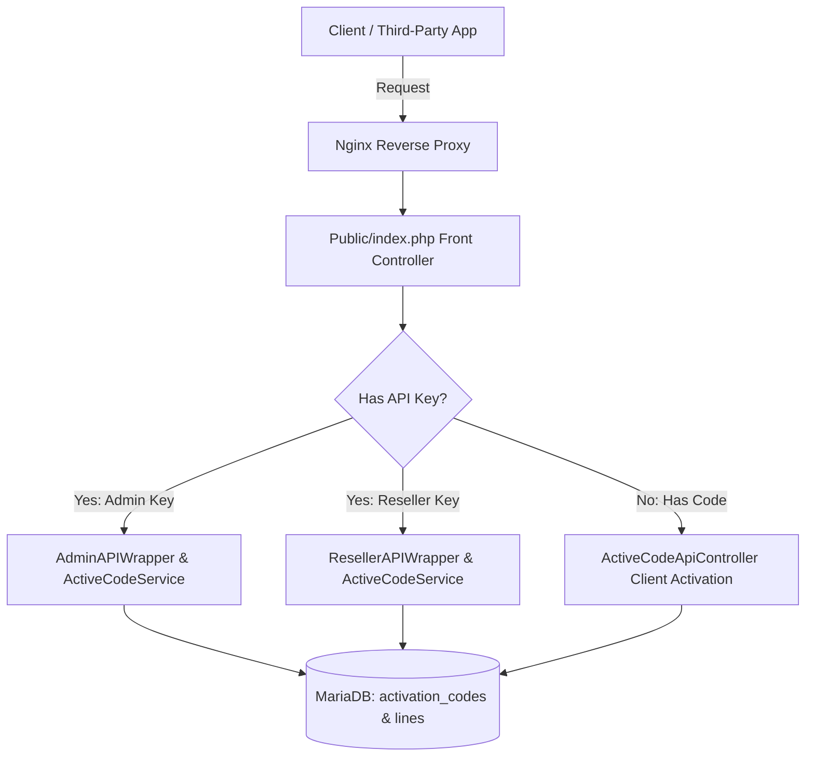

# XC_VM Active Codes (Smart Activation) — Master REST API Specification

A comprehensive technical reference for integrating, automating, and consuming the **Active Codes (Smart Activation System)** in the XC_VM IPTV Management Platform.

---

## 📑 Table of Contents
1. [Architectural Overview & Unified Router](#1-architectural-overview--unified-router)
2. [Authentication & Routing Strategies](#2-authentication--routing-strategies)
3. [Administrator REST API Reference](#3-administrator-rest-api-reference)
   - [3.1 List Active Codes (`get_active_codes`)](#31-list-active-codes-get_active_codes)
   - [3.2 Get Single Code Details (`get_active_code`)](#32-get-single-code-details-get_active_code)
   - [3.3 Generate Codes in Bulk or Single (`generate_active_codes`)](#33-generate-codes-in-bulk-or-single-generate_active_codes)
   - [3.4 Edit Active Code (`edit_active_code`)](#34-edit-active-code-edit_active_code)
   - [3.5 Suspend / Disable Code (`disable_active_code`)](#35-suspend--disable-code-disable_active_code)
   - [3.6 Enable / Reactivate Code (`enable_active_code`)](#36-enable--reactivate-code-enable_active_code)
   - [3.7 Reset Device & MAC Lock (`reset_active_code_device`)](#37-reset-device--mac-lock-reset_active_code_device)
   - [3.8 Delete Code (`delete_active_code`)](#38-delete-code-delete_active_code)
   - [3.9 Mass Actions Engine (`mass_active_codes`)](#39-mass-actions-engine-mass_active_codes)
   - [3.10 Batch Summary Metrics (`get_active_codes_batches`)](#310-batch-summary-metrics-get_active_codes_batches)
   - [3.11 Export Batch Vouchers (`export_active_code_batch`)](#311-export-batch-vouchers-export_active_code_batch)
4. [Reseller REST API Reference](#4-reseller-rest-api-reference)
   - [4.1 Security Isolation & Report Tree Permissions](#41-security-isolation--report-tree-permissions)
   - [4.2 Transactional Credits & Automatic Stock Refund](#42-transactional-credits--automatic-stock-refund)
   - [4.3 Reseller Endpoints & Parity](#43-reseller-endpoints--parity)
5. [Client Player & STB Activation API](#5-client-player--stb-activation-api)
   - [5.1 First-Time Activation & Delayed Countdown (`action=auth`)](#51-first-time-activation--delayed-countdown-actionauth)
   - [5.2 Non-Destructive Code Inspection (`action=check`)](#52-non-destructive-code-inspection-actioncheck)
   - [5.3 Hardware MAC & Device ID Binding](#53-hardware-mac--device-id-binding)
6. [Integration Code Examples](#6-integration-code-examples)
   - [cURL](#curl)
   - [Python 3](#python-3)
   - [PHP 8+](#php-8)
   - [JavaScript / Node.js](#javascript--nodejs)
7. [Error Handling & Status Codes](#7-error-handling--status-codes)

---

# 1. Architectural Overview & Unified Router

The **Active Codes System** decouples subscriber line generation from subscription expiration. Codes reside in inventory (`status = 1`, Ready/Stock) without consuming subscription time until the client powers up their device or app.

The API layer is built on a **Triple-Access Multi-Tenant Model**:
1. **Dedicated High-Performance Direct Route**: `/api/active_codes` (or `/api/active_code`). Supports `api_key` (auto-detects Admin vs. Reseller role) or client activation payloads.
2. **Standard REST API Routes**: Direct access via `/api/admin_api` and `/api/reseller_api`.
3. **Legacy Access Code Routes**: Full compatibility with panel access codes (e.g. `/{code}/` where access code is of Type 3 for Admin API or Type 4 for Reseller API).



---

# 2. Authentication & Routing Strategies

### Authentication Methods
Every management API request requires a valid user `api_key`. You can supply the key using any of the following 3 standards:

1. **HTTP Authorization Header** (Recommended):
   ```http
   Authorization: Bearer <YOUR_API_KEY>
   ```
2. **Custom HTTP Header**:
   ```http
   X-Api-Key: <YOUR_API_KEY>
   ```
3. **Form / Query / JSON Body**:
   ```json
   {
     "api_key": "<YOUR_API_KEY>",
     "action": "get_active_codes"
   }
   ```

### Base URLs
| Environment | Endpoint URL | Protocol | Auth Type |
| :--- | :--- | :--- | :--- |
| **Direct Unified Active Codes API** | `http(s)://<SERVER_IP>/api/active_codes` | HTTP/HTTPS | Admin or Reseller `api_key` |
| **Direct Admin REST API** | `http(s)://<SERVER_IP>/api/admin_api` | HTTP/HTTPS | Admin `api_key` |
| **Direct Reseller REST API** | `http(s)://<SERVER_IP>/api/reseller_api` | HTTP/HTTPS | Reseller `api_key` |
| **Client Activation / Player Portal** | `http(s)://<SERVER_IP>/api/active_code` | HTTP/HTTPS | Public (No API key needed) |

---

# 3. Administrator REST API Reference

The Administrator API provides unlimited, unrestricted management over all activation codes and subscriber lines across all resellers.

---

## 3.1 List Active Codes (`get_active_codes`)
Retrieve a paginated, filterable list of active codes with companion subscriber credentials and current operational status.

- **Action**: `get_active_codes` (or `list`, `get_codes`)
- **HTTP Method**: `GET` or `POST`

### Request Parameters
| Parameter | Type | Required | Default | Description |
| :--- | :--- | :---: | :---: | :--- |
| `api_key` | `string` | **Yes** | — | Administrator API key |
| `action` | `string` | **Yes** | — | `get_active_codes` |
| `start` | `int` | No | `0` | Offset for pagination |
| `limit` | `int` | No | `50` | Maximum records to return (up to 500) |
| `status` | `string` | No | — | Filter: `1` (Stock), `2` (Active), `3` (Expired), `0` (Disabled) |
| `batch_name` | `string` | No | — | Filter by batch name (e.g., `BATCH-20260913-13A1B`) |
| `package_id` | `int` | No | — | Filter by package ID |
| `created_by` | `int` | No | — | Filter by reseller / creator user ID |
| `search` | `string` | No | — | Search term (matches code, batch, username, MAC, device ID) |

### Example Request
```bash
curl -X POST "http://127.0.0.1/api/active_codes" \
  -H "Authorization: Bearer <ADMIN_API_KEY>" \
  -H "Content-Type: application/json" \
  -d '{
    "action": "get_active_codes",
    "status": "1",
    "limit": 2
  }'
```

### Response (`200 OK`)
```json
{
  "status": "STATUS_SUCCESS",
  "total": 14,
  "count": 2,
  "start": 0,
  "limit": 2,
  "data": [
    {
      "id": 25,
      "activation_code": "NDXL9ZQ3GR",
      "batch_name": "BATCH-20260913-13A1B",
      "status": 1,
      "status_key": "stock",
      "status_label": "Ready (Stock)",
      "package_id": 2,
      "package_name": "⚡ VIP PREMIUM | 1 Month Full Access",
      "subscriber_id": 20,
      "line_username": "ac_156aa7d6b",
      "line_password": "newSecretPass123",
      "exp_date": null,
      "exp_date_formatted": null,
      "remaining_days": 0,
      "mac": null,
      "device_id": null,
      "max_connections": 1,
      "is_trial": 0,
      "is_adult": 0,
      "purchase_cost": 1,
      "created_by": 2,
      "creator_username": "reseller_john",
      "created_at": 1789287410,
      "created_at_formatted": "2026-09-13 09:16:50",
      "activated_at": null,
      "activated_at_formatted": null
    }
  ]
}
```

---

## 3.2 Get Single Code Details (`get_active_code`)
Fetches comprehensive data for an individual code by its ID or by its activation code string.

- **Action**: `get_active_code` (or `get`, `details`)
- **HTTP Method**: `GET` or `POST`

### Request Parameters
| Parameter | Type | Required | Description |
| :--- | :--- | :---: | :--- |
| `id` / `code` | `int` or `string` | **Yes** | Numeric database ID or the alphanumeric code string |

### Example Request
```bash
curl -X POST "http://127.0.0.1/api/active_codes" \
  -H "Authorization: Bearer <ADMIN_API_KEY>" \
  -H "Content-Type: application/json" \
  -d '{
    "action": "get_active_code",
    "code": "NDXL9ZQ3GR"
  }'
```

### Response (`200 OK`)
```json
{
  "status": "STATUS_SUCCESS",
  "data": {
    "id": 22,
    "activation_code": "NDXL9ZQ3GR",
    "batch_name": "BATCH-20260913-13A1B",
    "status": 2,
    "status_key": "active",
    "status_label": "Active",
    "package": {
      "id": 2,
      "name": "⚡ VIP PREMIUM | 1 Month Full Access",
      "is_trial": false,
      "official_duration": "1",
      "official_duration_in": "months"
    },
    "subscriber_line": {
      "id": 20,
      "username": "ac_156aa7d6b",
      "password": "secretPassword123",
      "exp_date": 1793175442,
      "exp_date_formatted": "2026-10-28 08:17:22",
      "enabled": true,
      "admin_enabled": true,
      "last_ip": "156.214.191.143",
      "last_activity": "2026-09-13 09:17:22"
    },
    "device_binding": {
      "mac": "00:1A:79:B4:C2:11",
      "device_id": null,
      "is_locked": true
    },
    "connection_limits": {
      "max_connections": 2,
      "active_connections": 0
    },
    "playlists": {
      "m3u_hls": "http://domain.com/get.php?username=ac_156aa7d6b&password=secretPassword123&type=m3u_plus&output=hls",
      "m3u_ts": "http://domain.com/get.php?username=ac_156aa7d6b&password=secretPassword123&type=m3u_plus&output=ts"
    },
    "credentials": {
      "server_url": "http://domain.com",
      "username": "ac_156aa7d6b",
      "password": "secretPassword123"
    },
    "created_by": {
      "id": 1,
      "username": "Admin"
    },
    "created_at": 1789287410,
    "created_at_formatted": "2026-09-13 09:16:50",
    "activated_at": 1789287442,
    "activated_at_formatted": "2026-09-13 09:17:22"
  }
}
```

---

## 3.3 Generate Codes in Bulk or Single (`generate_active_codes`)
Generates collision-free cryptographically random active codes and automatically provision companion subscriber lines in delayed countdown (Stock) mode.

- **Action**: `generate_active_codes` (or `create_active_code`, `generate`, `create`)
- **HTTP Method**: `POST`

### Request Parameters
| Parameter | Type | Required | Default | Description |
| :--- | :--- | :---: | :---: | :--- |
| `package_id` | `int` | **Yes** | — | Target package ID |
| `num_codes` | `int` | No | `1` | Quantity to generate (1 to 500 per request) |
| `batch_name` | `string` | No | Auto | Custom batch name (defaults to `BATCH-YYYYMMDD-XXXXX`) |
| `code_length` | `int` | No | `10` | Code length (6 to 24 characters) |
| `code_format` | `string` | No | `alphanumeric` | Format: `alphanumeric` (excludes ambiguous 0,O,1,I) or `numeric` |
| `created_by` | `int` | No | Admin ID | Assign code ownership to a specific reseller user ID |
| `bouquets_selected`| `array[int]`| No | Package default | Array of bouquet IDs to assign |
| `category_template_id`| `int` | No | — | Category template ID for virtual channel layout sync |
| `max_connections`| `int` | No | Package default | Max concurrent client streams |
| `streaming_username`| `string`| No | Auto | Custom username (single code generation only) |
| `streaming_password`| `string`| No | Auto | Custom password (single code generation only) |
| `dns_base` | `string` | No | System default | Custom DNS portal URL override |

### Example Request
```bash
curl -X POST "http://127.0.0.1/api/active_codes" \
  -H "Authorization: Bearer <ADMIN_API_KEY>" \
  -H "Content-Type: application/json" \
  -d '{
    "action": "generate_active_codes",
    "package_id": 2,
    "num_codes": 3,
    "batch_name": "VIP-PROMO-AUTUMN",
    "code_length": 12,
    "code_format": "alphanumeric"
  }'
```

### Response (`200 OK`)
```json
{
  "status": "STATUS_SUCCESS",
  "message": "Successfully generated 3 active codes.",
  "batch_name": "VIP-PROMO-AUTUMN",
  "qty": 3,
  "data": [
    {
      "code": "7K9V4B82MYZP",
      "line_id": 31,
      "username": "ac_4719b2ca1",
      "password": "54cb10982d",
      "batch_name": "VIP-PROMO-AUTUMN"
    },
    {
      "code": "M3A98ZWPQ4TN",
      "line_id": 32,
      "username": "ac_08e1a53df",
      "password": "88aa92fc01",
      "batch_name": "VIP-PROMO-AUTUMN"
    },
    {
      "code": "E8P4DZL9YV2K",
      "line_id": 33,
      "username": "ac_b227c093a",
      "password": "3491ba65e4",
      "batch_name": "VIP-PROMO-AUTUMN"
    }
  ]
}
```

---

## 3.4 Edit Active Code (`edit_active_code`)
Modify code string, assigned package, max connections, streaming password, or expiration date.

- **Action**: `edit_active_code`
- **HTTP Method**: `POST`

### Request Parameters
| Parameter | Type | Required | Description |
| :--- | :--- | :---: | :--- |
| `id` | `int` | **Yes** | Code ID |
| `activation_code` | `string` | No | Update code string (must be unique) |
| `package_id` | `int` | No | Reassign package |
| `password` | `string` | No | Update streaming password |
| `max_connections`| `int` | No | Update concurrent streams allowed |
| `exp_date` | `string` or `int` | No | Set custom expiration timestamp (`YYYY-MM-DD HH:MM:SS` or unix timestamp) |
| `mac` | `string` | No | Update or set MAC lock |
| `device_id` | `string` | No | Update or set device ID |

---

## 3.5 Suspend / Disable Code (`disable_active_code`)
Immediately revokes client access (`status = 0`) and disconnects active streams.

- **Action**: `disable_active_code`
- **HTTP Method**: `POST`
- **Payload**: `{"action": "disable_active_code", "id": 22}`

---

## 3.6 Enable / Reactivate Code (`enable_active_code`)
Restores an active code and its companion subscriber line.

- **Action**: `enable_active_code`
- **HTTP Method**: `POST`
- **Payload**: `{"action": "enable_active_code", "id": 22}`

---

## 3.7 Reset Device & MAC Lock (`reset_active_code_device`)
Unbinds MAC address and Device ID locks, permitting the client to migrate their subscription to a new device or Smart TV app.

- **Action**: `reset_active_code_device` (or `reset_device`)
- **HTTP Method**: `POST`
- **Payload**: `{"action": "reset_active_code_device", "id": 22}` (or `"code": "NDXL9ZQ3GR"`)

### Response (`200 OK`)
```json
{
  "status": "STATUS_SUCCESS",
  "message": "Hardware and MAC address lock reset successfully.",
  "code_id": 22,
  "code": "NDXL9ZQ3GR"
}
```

---

## 3.8 Delete Code (`delete_active_code`)
Permanently removes the activation code record and its companion subscriber line from the database.

- **Action**: `delete_active_code` (or `delete`)
- **HTTP Method**: `POST`
- **Payload**: `{"action": "delete_active_code", "id": 22}`

---

## 3.9 Mass Actions Engine (`mass_active_codes`)
Execute bulk operations across an array of code IDs simultaneously.

- **Action**: `mass_active_codes`
- **HTTP Method**: `POST`

### Supported Sub-Actions (`sub_action`):
1. `enable` — Bulk activate or un-suspend.
2. `disable` — Bulk revoke / suspend.
3. `extend` — Bulk extend expiration dates (`days`: integer, e.g. `30`).
4. `reset_device` — Bulk clear hardware locks.
5. `change_package` — Bulk reassign package (`package_id`: integer).
6. `delete` — Bulk delete codes.

### Example Request
```bash
curl -X POST "http://127.0.0.1/api/active_codes" \
  -H "Authorization: Bearer <ADMIN_API_KEY>" \
  -H "Content-Type: application/json" \
  -d '{
    "action": "mass_active_codes",
    "sub_action": "extend",
    "days": 30,
    "ids": [21, 22, 25]
  }'
```

---

## 3.10 Batch Summary Metrics (`get_active_codes_batches`)
Retrieve inventory statistics grouped by generation batch.

- **Action**: `get_active_codes_batches` (or `batches`)
- **HTTP Method**: `GET` or `POST`

### Response (`200 OK`)
```json
{
  "status": "STATUS_SUCCESS",
  "data": [
    {
      "batch_name": "VIP-PROMO-AUTUMN",
      "created_by": "1",
      "package_id": "2",
      "package_name": "⚡ VIP PREMIUM | 1 Month Full Access",
      "creator_name": "Admin",
      "total_codes": "50",
      "stock_count": "38",
      "active_count": "12",
      "disabled_count": "0",
      "created_at": "1789287410"
    }
  ]
}
```

---

## 3.11 Export Batch Vouchers (`export_active_code_batch`)
Export batch credentials in structured JSON or ASCII scratch-card layout.

- **Action**: `export_active_code_batch` (or `export`)
- **Parameters**: `batch_name` (`string`), `format` (`json` or `txt`)

---

# 4. Reseller REST API Reference

The Reseller REST API allows master resellers and distributors to automate their business, integrate with billing systems (WHMCS, WooCommerce, Telegram Bots), and manage customer codes.

---

## 4.1 Security Isolation & Report Tree Permissions
- **Downline Scoping**: Resellers can **only** view, edit, reset, or delete codes where `created_by` matches their own User ID or any sub-reseller within their hierarchy (`$rUserInfo['reports']`).
- **Zero Cross-Contamination**: Any attempt to access or mutate an administrator's code or an external reseller's code returns `STATUS_FAILURE` with `Access denied`.
- **Package Group Enforcement**: Resellers cannot generate packages not explicitly enabled for their account group.

---

## 4.2 Transactional Credits & Automatic Stock Refund
1. **Deduction on Generation**: Generating codes automatically deducts credits (`totalCost = qty * package_cost`). If available credits are insufficient, returns `INSUFFICIENT_CREDITS`.
2. **Zero-Loss Stock Refund**: When a reseller deletes unactivated stock codes (`status = 1`), the system automatically calculates the purchase cost and **refunds the reseller's credits in full**.

---

## 4.3 Reseller Endpoints & Parity
The Reseller API supports the identical actions as the Admin API:
- `get_active_codes`
- `get_active_code`
- `generate_active_codes`
- `edit_active_code`
- `disable_active_code`
- `enable_active_code`
- `reset_active_code_device`
- `delete_active_code`
- `mass_active_codes`
- `get_active_codes_batches`
- `export_active_code_batch`

All responses include `remaining_credits` reflecting real-time wallet balances.

---

# 5. Client Player & STB Activation API

End-user devices, Smart TV applications, and activation portals interact directly with the client activation endpoint **without requiring an API key**.

- **Endpoints**:
  - `POST /api/active_code`
  - `POST /api/active_codes`
  - `GET /api/active_code?code=VIP-9482-1049`

---

## 5.1 First-Time Activation & Delayed Countdown (`action=auth`)
When a subscriber submits their code for the first time:
1. Status transitions from `1` (Stock/Ready) to `2` (Active).
2. The countdown starts immediately (`exp_date = NOW() + PackageDuration`).
3. If MAC address or Device ID is provided, the code is locked to that hardware.
4. Returns Xtream Codes compatible credentials and M3U playlists.

### Request
```http
POST /api/active_code
Content-Type: application/json

{
  "code": "NDXL9ZQ3GR",
  "mac": "00:1A:79:B4:C2:11",
  "device_id": "XIAOMI-BOX-S2"
}
```

### Response (`200 OK`)
```json
{
  "status": "SUCCESS",
  "user_info": {
    "username": "ac_156aa7d6b",
    "password": "secretPassword123",
    "message": "Welcome to IPTV",
    "auth": 1,
    "status": "Active",
    "exp_date": "1791879442",
    "exp_formatted": "2026-10-13 09:17:22",
    "is_trial": "0",
    "active_cons": "0",
    "created_at": "1789287410",
    "max_connections": "1",
    "allowed_output_formats": ["m3u8", "ts", "rtmp"]
  },
  "server_info": {
    "version": "2.5.1",
    "url": "iptv.domain.com",
    "port": "80",
    "https_port": "443",
    "server_protocol": "https",
    "rtmp_port": "8880",
    "timestamp_now": 1789287442,
    "time_now": "2026-09-13 09:17:22",
    "timezone": "UTC"
  },
  "active_code": {
    "code": "NDXL9ZQ3GR",
    "batch_name": "VIP-PROMO-AUTUMN",
    "package_name": "⚡ VIP PREMIUM | 1 Month Full Access",
    "status": "Active",
    "is_new_activation": true
  },
  "playlists": {
    "m3u_ts": "https://iptv.domain.com/get.php?username=ac_156aa7d6b&password=secretPassword123&type=m3u_plus&output=ts",
    "m3u_hls": "https://iptv.domain.com/get.php?username=ac_156aa7d6b&password=secretPassword123&type=m3u_plus&output=m3u8"
  },
  "player_api_url": "https://iptv.domain.com/player_api.php?username=ac_156aa7d6b&password=secretPassword123"
}
```

---

## 5.2 Non-Destructive Code Inspection (`action=check`)
Verify whether a code is valid, inspect its package name, or check remaining subscription days **without consuming stock or starting the countdown timer**.

### Request
```bash
curl -X POST "http://domain.com/api/active_code" \
  -d "code=NDXL9ZQ3GR&action=check"
```

### Response (`200 OK`)
```json
{
  "status": "SUCCESS",
  "valid": true,
  "code": "NDXL9ZQ3GR",
  "code_status": 1,
  "status_label": "Ready (Stock)",
  "package_name": "⚡ VIP PREMIUM | 1 Month Full Access",
  "is_trial": false,
  "max_connections": 1,
  "is_activated": false,
  "activated_at": null,
  "exp_date": null,
  "is_device_locked": false,
  "locked_mac": null
}
```

---

## 5.3 Hardware MAC & Device ID Binding
If a code was activated on one device and a second device attempts to connect with a mismatched MAC:
```json
{
  "status": "ERROR",
  "error_code": "DEVICE_MISMATCH",
  "user_info": { "auth": 0 },
  "message": "Code is locked to another hardware device (MAC: 00:1A:79:B4:C2:11)."
}
```
The reseller or administrator can clear this lock at any time using `reset_active_code_device`.

---

# 6. Integration Code Examples

### cURL
```bash
# 1. Generate 5 codes as Reseller
curl -X POST "https://your-panel.com/api/active_codes" \
  -H "Authorization: Bearer <RESELLER_KEY>" \
  -H "Content-Type: application/json" \
  -d '{
    "action": "generate_active_codes",
    "package_id": 2,
    "num_codes": 5,
    "batch_name": "TELEGRAM-SALES"
  }'

# 2. Reset Device Lock
curl -X POST "https://your-panel.com/api/active_codes" \
  -H "Authorization: Bearer <RESELLER_KEY>" \
  -d "action=reset_active_code_device&code=NDXL9ZQ3GR"
```

---

### Python 3
```python
import requests

BASE_URL = "https://your-panel.com/api/active_codes"
API_KEY = "reseller_key_test1234567890"

headers = {
    "Authorization": f"Bearer {API_KEY}",
    "Content-Type": "application/json"
}

# Generate 1 Active Code
payload = {
    "action": "generate_active_codes",
    "package_id": 2,
    "num_codes": 1,
    "code_length": 10
}

response = requests.post(BASE_URL, json=payload, headers=headers)
data = response.json()

if data.get("status") == "STATUS_SUCCESS":
    code_info = data["data"][0]
    print(f"Generated Code: {code_info['code']}")
    print(f"Remaining Credits: {data.get('remaining_credits')}")
else:
    print(f"Error: {data.get('error')}")
```

---

### PHP 8+
```php
<?php

$apiUrl = 'https://your-panel.com/api/active_codes';
$apiKey = 'reseller_key_test1234567890';

$payload = [
    'action' => 'get_active_codes',
    'status' => 'active',
    'limit'  => 10,
];

$ch = curl_init($apiUrl);
curl_setopt_array($ch, [
    CURLOPT_RETURNTRANSFER => true,
    CURLOPT_POST           => true,
    CURLOPT_POSTFIELDS     => json_encode($payload),
    CURLOPT_HTTPHEADER     => [
        'Authorization: Bearer ' . $apiKey,
        'Content-Type: application/json',
    ],
]);

$response = curl_exec($ch);
curl_close($ch);

$result = json_decode($response, true);
print_r($result);
```

---

### JavaScript / Node.js
```javascript
const axios = require('axios');

async function checkCode(code) {
  try {
    const res = await axios.post('https://your-panel.com/api/active_code', {
      action: 'check',
      code: code,
    });
    console.log('Status:', res.data.status_label);
    console.log('Package:', res.data.package_name);
  } catch (err) {
    console.error('Check failed:', err.response?.data || err.message);
  }
}

checkCode('NDXL9ZQ3GR');
```

---

# 7. Error Handling & Status Codes

| Error Code | HTTP Status | Description | Solution |
| :--- | :---: | :--- | :--- |
| `INVALID_API_KEY` | `401 Unauthorized` | Provided API key does not exist or user is disabled | Verify user API key in panel profile |
| `INSUFFICIENT_CREDITS`| `200 OK` | Reseller credit wallet balance is less than required | Add credits to reseller account |
| `INVALID_CODE` | `200 OK` / `400 Bad Request` | Code string does not exist in `activation_codes` | Check spelling or generate new code |
| `DEVICE_MISMATCH` | `200 OK` | Device MAC / ID does not match the bound hardware | Call `reset_active_code_device` |
| `EXPIRED` | `200 OK` | Code subscription duration has elapsed | Renew line or purchase extension |
| `DISABLED` | `200 OK` | Code was revoked / suspended by administrator | Enable code using `enable_active_code` |

---

*Document Revision: 3.0 — XC_VM Platform Unified Engineering Standards*
