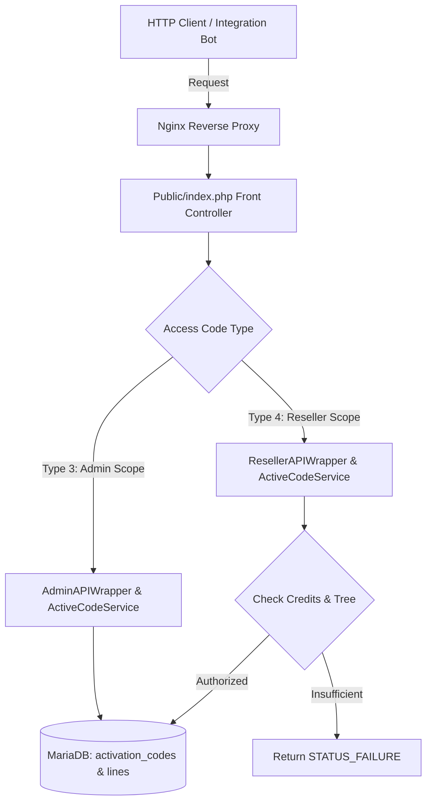

# XC_VM — Smart Activation Codes REST API Specification

A comprehensive, production-grade technical reference for integrating, automating, and consuming the **Active Codes (Smart Activation System)** in the **XC_VM** IPTV Management Platform using the official **Access Code** routing architecture.

---

## 📑 Table of Contents

- [Architecture Overview & Routing Mechanism](#architecture-overview--routing-mechanism)
- [PART 1: Administrator REST API Reference (Admin API)](#part-1-administrator-rest-api-reference-admin-api)
  - [1. Setup & Credentials Retrieval](#1-setup--credentials-retrieval)
  - [2. Request Protocol & Base URL Format](#2-request-protocol--base-url-format)
  - [3. Supported Actions Reference](#3-supported-actions-reference)
    - [3.1 List Active Codes (`get_active_codes`)](#31-list-active-codes-get_active_codes)
    - [3.2 Get Single Code Details & Playback URLs (`get_active_code`)](#32-get-single-code-details--playback-urls-get_active_code)
    - [3.3 Generate Active Codes in Bulk or Single (`generate_active_codes`)](#33-generate-active-codes-in-bulk-or-single-generate_active_codes)
    - [3.4 Edit Active Code & Line Properties (`edit_active_code`)](#34-edit-active-code--line-properties-edit_active_code)
    - [3.5 Non-Destructive Code Inspection (`check_active_code`)](#35-non-destructive-code-inspection-check_active_code)
    - [3.6 Suspend / Disable Code (`disable_active_code`)](#36-suspend--disable-code-disable_active_code)
    - [3.7 Enable / Reactivate Code (`enable_active_code`)](#37-enable--reactivate-code-enable_active_code)
    - [3.8 Reset Hardware MAC & Device ID Lock (`reset_active_code_device`)](#38-reset-hardware-mac--device-id-lock-reset_active_code_device)
    - [3.9 Delete Code (`delete_active_code`)](#39-delete-code-delete_active_code)
    - [3.10 Mass Actions Engine (`mass_active_codes`)](#310-mass-actions-engine-mass_active_codes)
    - [3.11 Batch Summary Metrics (`get_active_codes_batches`)](#311-batch-summary-metrics-get_active_codes_batches)
    - [3.12 Export Batch Vouchers (`export_active_code_batch`)](#312-export-batch-vouchers-export_active_code_batch)
  - [4. Administrator Implementation Examples](#4-administrator-implementation-examples)
- [PART 2: Reseller REST API Reference (Reseller API)](#part-2-reseller-rest-api-reference-reseller-api)
  - [1. Setup & Credentials Retrieval](#1-setup--credentials-retrieval-1)
  - [2. Security Isolation & Automatic Credit Accounting](#2-security-isolation--automatic-credit-accounting)
  - [3. Request Protocol & Base URL Format](#3-request-protocol--base-url-format)
  - [4. Reseller Actions Reference](#4-reseller-actions-reference)
    - [4.1 Account Information & Credit Balance (`user_info`)](#41-account-information--credit-balance-user_info)
    - [4.2 List Downline Active Codes (`get_active_codes`)](#42-list-downline-active-codes-get_active_codes)
    - [4.3 Get Reseller Code Details (`get_active_code`)](#43-get-reseller-code-details-get_active_code)
    - [4.4 Generate Codes with Transactional Credit Deduction (`generate_active_codes`)](#44-generate-codes-with-transactional-credit-deduction-generate_active_codes)
    - [4.5 Inspect Code Status (`check_active_code`)](#45-inspect-code-status-check_active_code)
    - [4.6 Reset Device MAC for Subscriber (`reset_active_code_device`)](#46-reset-device-mac-for-subscriber-reset_active_code_device)
    - [4.7 Suspend & Reactivate Code (`disable_active_code` / `enable_active_code`)](#47-suspend--reactivate-code-disable_active_code--enable_active_code)
    - [4.8 Delete Code with Automatic Credit Refund (`delete_active_code`)](#48-delete-code-with-automatic-credit-refund-delete_active_code)
    - [4.9 Reseller Batches & Voucher Export (`get_active_codes_batches` / `export_active_code_batch`)](#49-reseller-batches--voucher-export)
  - [5. Reseller Implementation Examples](#5-reseller-implementation-examples)
- [ADDENDUM: Client Player & STB Direct Activation API](#addendum-client-player--stb-direct-activation-api)
- [Quick Comparison Matrix](#quick-comparison-matrix)

---

# Architecture Overview & Routing Mechanism

The **Active Codes System** in **XC_VM** separates line generation from subscription expiration. Codes are stored in inventory (`status = 1`, Ready / Stock) without consuming subscription duration until the subscriber powers up their device or application.

The API layer is built on the native **Access Code** model:
1. **Access Code**: A unique dynamic route defined in the panel under `Settings -> Access Codes`. Nginx creates isolated configuration blocks that forward traffic to the appropriate backend controller:
   - **Type 3 (Admin API)**: Maps to the `AdminAPIWrapper` layer with global system authority.
   - **Type 4 (Reseller API)**: Maps to the `ResellerAPIWrapper` layer with strict sub-user isolation and credit validation.
2. **API Key**: The user's private 32-character authentication token assigned to their panel account, validated per request.



---

# PART 1: Administrator REST API Reference (Admin API)

Designed for server administrators to automate code generation, lifecycle management, subscriber diagnostics, and inventory control with unrestricted authority across the entire platform.

## 1. Setup & Credentials Retrieval

1. **Admin Access Code**:
   - Navigate to `Admin Panel -> Settings -> Access Codes`.
   - Click **Add Access Code**.
   - Select **Type: Admin API**.
   - Set the code string (e.g. `admin_api` or a custom 32-character hash like `9ABDC3947EC81B3D15B7478975E32F68`).
   - Ensure the status is set to **Enabled**.

2. **Admin API Key**:
   - Go to `Admin Panel -> Manage Users -> Edit User (Administrator)`.
   - Copy the value from the **API Key** field (e.g. `9ABDC3947EC81B3D15B7478975E32F68`).

---

## 2. Request Protocol & Base URL Format

Requests may be dispatched via **GET** (query parameters) or **POST** (`application/x-www-form-urlencoded`):

```http
GET /<ADMIN_ACCESS_CODE>/?api_key=<ADMIN_API_KEY>&action=<ACTION>&[parameters] HTTP/1.1
Host: your-server.com
```

Or via POST:
```http
POST /<ADMIN_ACCESS_CODE>/ HTTP/1.1
Host: your-server.com
Content-Type: application/x-www-form-urlencoded

api_key=<ADMIN_API_KEY>&action=<ACTION>&[parameters]
```

---

## 3. Supported Actions Reference

### 3.1 List Active Codes (`get_active_codes`)

Retrieves a paginated list of all active codes on the server with multi-criteria filtering.

**Parameters:**
| Parameter | Type | Required | Description |
| :--- | :--- | :--- | :--- |
| `action` | string | **Yes** | Value: `get_active_codes` |
| `start` | integer | No | Offset index. Default: `0` |
| `limit` | integer | No | Page size limit. Default: `50` (Max: `500`) |
| `status` | string/int | No | Status filter: `stock` (1), `active` (2), `disabled` (3), `expired` |
| `package_id` | integer | No | Filter by package ID |
| `batch_name` | string | No | Filter by batch identifier (e.g. `BATCH-20260913-13A1B`) |
| `search` | string | No | Full-text search matching code, username, MAC, or device ID |

**cURL Example:**
```bash
curl -s "http://your-server.com/admin_api/?api_key=ADMIN_KEY&action=get_active_codes&status=active&limit=10"
```

**JSON Response:**
```json
{
  "status": "STATUS_SUCCESS",
  "total": 142,
  "count": 10,
  "start": 0,
  "limit": 10,
  "data": [
    {
      "id": 22,
      "activation_code": "NDXL9ZQ3GR",
      "batch_name": "BATCH-20260913-13A1B",
      "status": 2,
      "status_key": "active",
      "status_label": "Active",
      "package_id": 2,
      "package_name": "⚡ VIP PREMIUM | 1 Month Full Access",
      "subscriber_id": 20,
      "line_username": "ac_156aa7d6b",
      "line_password": "newSecretPass123",
      "exp_date": 1793175442,
      "exp_date_formatted": "2026-10-28 08:17:22",
      "remaining_days": 45,
      "mac": "11:22:33:44:55:66",
      "device_id": null,
      "max_connections": 2,
      "is_trial": 0,
      "purchase_cost": 1,
      "created_by": 2,
      "creator_username": "reseller_123",
      "created_at": 1789287410,
      "created_at_formatted": "2026-09-13 09:16:50",
      "activated_at": 1789287442,
      "activated_at_formatted": "2026-09-13 09:17:22"
    }
  ]
}
```

---

### 3.2 Get Single Code Details & Playback URLs (`get_active_code`)

Fetches granular details for a single code, including streaming credentials and ready-to-use playback URLs.

**Parameters:**
| Parameter | Type | Required | Description |
| :--- | :--- | :--- | :--- |
| `action` | string | **Yes** | Value: `get_active_code` |
| `id` or `code` | mixed | **Yes** | Database ID (e.g. `id=22`) or alphanumeric code (`code=NDXL9ZQ3GR`) |

**cURL Example:**
```bash
curl -s "http://your-server.com/admin_api/?api_key=ADMIN_KEY&action=get_active_code&id=22"
```

**JSON Response:**
```json
{
  "status": "STATUS_SUCCESS",
  "data": {
    "id": 22,
    "activation_code": "NDXL9ZQ3GR",
    "batch_name": "BATCH-20260913-13A1B",
    "status": 2,
    "status_key": "active",
    "status_label": "Active",
    "package": {
      "id": 2,
      "name": "⚡ VIP PREMIUM | 1 Month Full Access"
    },
    "credentials": {
      "line_id": 20,
      "username": "ac_156aa7d6b",
      "password": "newSecretPass123"
    },
    "playback": {
      "player_api": "http://your-server.com/player_api.php?username=ac_156aa7d6b&password=newSecretPass123",
      "m3u_plus": "http://your-server.com/get.php?username=ac_156aa7d6b&password=newSecretPass123&type=m3u_plus&output=ts",
      "epg": "http://your-server.com/xmltv.php?username=ac_156aa7d6b&password=newSecretPass123"
    },
    "device_lock": {
      "mac": "11:22:33:44:55:66",
      "device_id": null
    }
  }
}
```

---

### 3.3 Generate Active Codes in Bulk or Single (`generate_active_codes`)

Generates unactivated inventory vouchers in bulk or as a single code. Subscription duration countdown does not start until first activation.

**Parameters:**
| Parameter | Type | Required | Description |
| :--- | :--- | :--- | :--- |
| `action` | string | **Yes** | Value: `generate_active_codes` (or alias: `create_active_code`) |
| `package_id` | integer | **Yes** | Target package ID |
| `count` | integer | No | Number of codes to create (Default: 1, Max: 500) |
| `tag` | string | No | Custom identifier or marketing campaign tag (e.g. `PromoSummer`) |
| `code_format` | string | No | Format: `alpha` (alphanumeric, default) or `numeric` (digits only) |
| `code_length` | integer | No | Code string length (Default: 10 or 12) |
| `assigned_owner_id` | integer | No | Assign generated codes to a specific reseller ID (Admin only) |

**cURL Example:**
```bash
curl -s -X POST "http://your-server.com/admin_api/" \
  -d "api_key=ADMIN_KEY" \
  -d "action=generate_active_codes" \
  -d "package_id=2" \
  -d "count=2" \
  -d "tag=VipBulkOffer"
```

**JSON Response:**
```json
{
  "status": "STATUS_SUCCESS",
  "message": "Successfully generated 2 active codes.",
  "batch_name": "BATCH-20260913-91ABC",
  "qty": 2,
  "data": [
    {
      "code": "X7K9P2W4LM",
      "line_id": 25,
      "username": "ac_47d8e2091",
      "password": "a1b2c3d4e5",
      "batch_name": "BATCH-20260913-91ABC"
    },
    {
      "code": "J3N8Q5T1VR",
      "line_id": 26,
      "username": "ac_65d9f3012",
      "password": "f6g7h8i9j0",
      "batch_name": "BATCH-20260913-91ABC"
    }
  ]
}
```

---

### 3.4 Edit Active Code & Line Properties (`edit_active_code`)

Modifies properties of an active code and its associated line record.

**Parameters:**
| Parameter | Type | Required | Description |
| :--- | :--- | :--- | :--- |
| `action` | string | **Yes** | Value: `edit_active_code` |
| `id` | integer | **Yes** | Active code database ID |
| `password` | string | No | Update line password |
| `max_connections` | integer | No | Update allowed concurrent streaming connections |
| `exp_date` | string/int | No | Set new expiration date (`YYYY-MM-DD` or Unix timestamp) |
| `mac` | string | No | Explicitly set or override locked MAC address |

**cURL Example:**
```bash
curl -s -X POST "http://your-server.com/admin_api/" \
  -d "api_key=ADMIN_KEY" \
  -d "action=edit_active_code" \
  -d "id=22" \
  -d "max_connections=3" \
  -d "password=NewSecurePass2026"
```

---

### 3.5 Non-Destructive Code Inspection (`check_active_code`)

Inspects the state of an activation code without activating it or starting its timer.

**Parameters:**
| Parameter | Type | Required | Description |
| :--- | :--- | :--- | :--- |
| `action` | string | **Yes** | Value: `check_active_code` |
| `code` | string | **Yes** | Code string to inspect |

**cURL Example:**
```bash
curl -s "http://your-server.com/admin_api/?api_key=ADMIN_KEY&action=check_active_code&code=NDXL9ZQ3GR"
```

**JSON Response:**
```json
{
  "status": "STATUS_SUCCESS",
  "data": {
    "status": "SUCCESS",
    "valid": true,
    "code": "NDXL9ZQ3GR",
    "code_status": 2,
    "status_label": "Active",
    "package_name": "⚡ VIP PREMIUM | 1 Month Full Access",
    "is_trial": false,
    "max_connections": 2,
    "is_activated": true,
    "activated_at": "2026-09-13 09:17:22",
    "exp_date": 1793175442,
    "exp_date_formatted": "2026-10-28 08:17:22",
    "remaining_days": 45,
    "is_device_locked": true,
    "locked_mac": "11:22:33:44:55:66"
  }
}
```

---

### 3.6 Suspend / Disable Code (`disable_active_code`)

Immediately revokes streaming access for the code and underlying line.

**cURL Example:**
```bash
curl -s "http://your-server.com/admin_api/?api_key=ADMIN_KEY&action=disable_active_code&id=22"
```

---

### 3.7 Enable / Reactivate Code (`enable_active_code`)

Reactivates a suspended code.

**cURL Example:**
```bash
curl -s "http://your-server.com/admin_api/?api_key=ADMIN_KEY&action=enable_active_code&id=22"
```

---

### 3.8 Reset Hardware MAC & Device ID Lock (`reset_active_code_device`)

Clears bound MAC addresses and hardware device identifiers, allowing the subscriber to migrate their subscription to another device.

**cURL Example:**
```bash
curl -s "http://your-server.com/admin_api/?api_key=ADMIN_KEY&action=reset_active_code_device&code=NDXL9ZQ3GR"
```

**JSON Response:**
```json
{
  "status": "STATUS_SUCCESS",
  "message": "Device binding cleared successfully for code NDXL9ZQ3GR"
}
```

---

### 3.9 Delete Code (`delete_active_code`)

Permanently deletes the active code and its associated line record.

**cURL Example:**
```bash
curl -s "http://your-server.com/admin_api/?api_key=ADMIN_KEY&action=delete_active_code&id=22"
```

---

### 3.10 Mass Actions Engine (`mass_active_codes`)

Executes bulk operations across an array of code IDs in a single atomic transaction.

**Parameters:**
| Parameter | Type | Required | Description |
| :--- | :--- | :--- | :--- |
| `action` | string | **Yes** | Value: `mass_active_codes` |
| `sub_action` | string | **Yes** | Action type: `delete`, `enable`, `disable`, `reset_device`, or `extend` |
| `ids` | array/string | **Yes** | Comma-delimited string or JSON array of IDs (e.g. `ids=22,23,24`) |
| `days` | integer | No | Extension duration (required only if `sub_action=extend`) |

**cURL Example:**
```bash
curl -s -X POST "http://your-server.com/admin_api/" \
  -d "api_key=ADMIN_KEY" \
  -d "action=mass_active_codes" \
  -d "sub_action=reset_device" \
  -d "ids=22,23,24"
```

---

### 3.11 Batch Summary Metrics (`get_active_codes_batches`)

Retrieves aggregated inventory metrics per batch (total codes, active, stock, expired, disabled).

**cURL Example:**
```bash
curl -s "http://your-server.com/admin_api/?api_key=ADMIN_KEY&action=get_active_codes_batches"
```

---

### 3.12 Export Batch Vouchers (`export_active_code_batch`)

Exports vouchers for physical card printing or external billing integration.

**Parameters:**
| Parameter | Type | Required | Description |
| :--- | :--- | :--- | :--- |
| `action` | string | **Yes** | Value: `export_active_code_batch` |
| `batch_name` | string | **Yes** | Name of the batch (e.g. `BATCH-20260913-13A1B`) |
| `format` | string | No | Format: `json` (default) or `txt` |

**cURL Example:**
```bash
curl -s "http://your-server.com/admin_api/?api_key=ADMIN_KEY&action=export_active_code_batch&batch_name=BATCH-20260913-13A1B&format=json"
```

---

## 4. Administrator Implementation Examples

### Python 3
```python
import requests

BASE_URL = "http://your-server.com"
ADMIN_ACCESS_CODE = "admin_api"
ADMIN_API_KEY = "9ABDC3947EC81B3D15B7478975E32F68"

endpoint = f"{BASE_URL}/{ADMIN_ACCESS_CODE}/"

# 1. Generate a new code
gen_response = requests.post(endpoint, data={
    "api_key": ADMIN_API_KEY,
    "action": "generate_active_codes",
    "package_id": 2,
    "count": 1,
    "tag": "EnterpriseClient"
})
gen_data = gen_response.json()
code = gen_data["data"][0]["code"]
print(f"Created Code: {code}")

# 2. Inspect the code non-destructively
inspect_res = requests.get(endpoint, params={
    "api_key": ADMIN_API_KEY,
    "action": "check_active_code",
    "code": code
})
print("Code Status:", inspect_res.json())
```

### PHP 8+
```php
<?php
$serverUrl = "http://your-server.com";
$accessCode = "admin_api";
$apiKey = "9ABDC3947EC81B3D15B7478975E32F68";

$url = "{$serverUrl}/{$accessCode}/?api_key={$apiKey}&action=get_active_codes&limit=10";

$ch = curl_init($url);
curl_setopt($ch, CURLOPT_RETURNTRANSFER, true);
curl_setopt($ch, CURLOPT_TIMEOUT, 15);
$response = curl_exec($ch);
curl_close($ch);

$result = json_decode($response, true);
print_r($result);
```

### JavaScript / Node.js
```javascript
const SERVER = 'http://your-server.com';
const ACCESS_CODE = 'admin_api';
const API_KEY = '9ABDC3947EC81B3D15B7478975E32F68';

async function resetDeviceLock(codeString) {
    const params = new URLSearchParams({
        api_key: API_KEY,
        action: 'reset_active_code_device',
        code: codeString
    });

    const res = await fetch(`${SERVER}/${ACCESS_CODE}/?${params}`);
    const data = await res.json();
    console.log(data);
}

resetDeviceLock('NDXL9ZQ3GR');
```

---

# PART 2: Reseller REST API Reference (Reseller API)

Designed for resellers, sub-dealers, Telegram automation bots, and self-service portals. Enforces strict tree-based data isolation and automated transactional credit accounting.

## 1. Setup & Credentials Retrieval

1. **Reseller Access Code**:
   - Configured by the Administrator under `Settings -> Access Codes` with **Type: Reseller API**.
   - Accessible under a defined path (e.g. `reseller_api` or a randomized string).

2. **Reseller API Key**:
   - Each reseller possesses their own unique **API Key** generated in their profile.
   - Example: `D9AD0953309AB740CBC9684C465642F6`.

---

## 2. Security Isolation & Automatic Credit Accounting

1. **Strict Downline Tree Isolation**:
   - Resellers cannot view, edit, check, or delete any code belonging to an administrator or another reseller outside their authorized sub-user hierarchy (`reports`).
   - Query filters (`get_active_codes`) automatically inject `created_by IN (reports)` bounds.
2. **Transactional Credit Deduction**:
   - When calling `generate_active_codes`, the system verifies the reseller has sufficient balance (`credits >= total_cost`).
   - If insufficient, the request aborts with: `Insufficient credits. Required: X, Available: Y`.
   - Upon success, credits are deducted immediately and the updated balance is returned in `remaining_credits`.
3. **Automatic Credit Refund on Stock Deletion**:
   - If a reseller deletes an unactivated code (`status = 1`, Ready/Stock), the system **automatically refunds the full purchase cost** back to the reseller's wallet and confirms the refund in the response.

---

## 3. Request Protocol & Base URL Format

```http
GET /<RESELLER_ACCESS_CODE>/?api_key=<RESELLER_API_KEY>&action=<ACTION>&[parameters] HTTP/1.1
Host: your-server.com
```

Or via POST:
```http
POST /<RESELLER_ACCESS_CODE>/ HTTP/1.1
Host: your-server.com
Content-Type: application/x-www-form-urlencoded

api_key=<RESELLER_API_KEY>&action=<ACTION>&[parameters]
```

---

## 4. Reseller Actions Reference

### 4.1 Account Information & Credit Balance (`user_info`)

Fetches account details, available credit balance, and assigned package permissions.

**cURL Example:**
```bash
curl -s "http://your-server.com/reseller_api/?api_key=RESELLER_KEY&action=user_info"
```

**JSON Response:**
```json
{
  "status": "STATUS_SUCCESS",
  "data": {
    "id": "2",
    "username": "reseller_123",
    "credits": "5999",
    "status": "1",
    "api_key": "D9AD0953309AB740CBC9684C465642F6"
  }
}
```

---

### 4.2 List Downline Active Codes (`get_active_codes`)

Returns active codes belonging exclusively to the authenticated reseller and their sub-resellers.

**cURL Example:**
```bash
curl -s "http://your-server.com/reseller_api/?api_key=RESELLER_KEY&action=get_active_codes&status=stock"
```

---

### 4.3 Get Reseller Code Details (`get_active_code`)

Retrieves code credentials and streaming links for a code owned by the reseller.

**cURL Example:**
```bash
curl -s "http://your-server.com/reseller_api/?api_key=RESELLER_KEY&action=get_active_code&id=24"
```

---

### 4.4 Generate Codes with Transactional Credit Deduction (`generate_active_codes`)

Generates unactivated codes and immediately debits the required credits from the reseller's wallet.

**Parameters:**
| Parameter | Type | Required | Description |
| :--- | :--- | :--- | :--- |
| `action` | string | **Yes** | Value: `generate_active_codes` |
| `package_id` | integer | **Yes** | Package ID (must be permitted in reseller's allowed packages) |
| `count` | integer | No | Quantity to generate (Default: 1) |
| `tag` | string | No | Label or subscriber identifier |

**cURL Example:**
```bash
curl -s -X POST "http://your-server.com/reseller_api/" \
  -d "api_key=RESELLER_KEY" \
  -d "action=generate_active_codes" \
  -d "package_id=2" \
  -d "count=1" \
  -d "tag=ClientJohn"
```

**JSON Response:**
```json
{
  "status": "STATUS_SUCCESS",
  "message": "Successfully generated 1 active codes.",
  "batch_name": "BATCH-20260913-BD8EC",
  "qty": 1,
  "total_cost": 1,
  "remaining_credits": 5998,
  "data": [
    {
      "code": "GGYJHA7SWW",
      "line_id": 24,
      "username": "ac_1ddc54ddd",
      "password": "cf04c9ca6b",
      "batch_name": "BATCH-20260913-BD8EC"
    }
  ]
}
```

---

### 4.5 Inspect Code Status (`check_active_code`)

Inspects subscription state, expiration date, and device binding without modifying code status.

**cURL Example:**
```bash
curl -s "http://your-server.com/reseller_api/?api_key=RESELLER_KEY&action=check_active_code&code=GGYJHA7SWW"
```

---

### 4.6 Reset Device MAC for Subscriber (`reset_active_code_device`)

Clears bound MAC and hardware IDs for a subscriber under the reseller's account.

**cURL Example:**
```bash
curl -s "http://your-server.com/reseller_api/?api_key=RESELLER_KEY&action=reset_active_code_device&code=GGYJHA7SWW"
```

---

### 4.7 Suspend & Reactivate Code (`disable_active_code` / `enable_active_code`)

- **Suspend Code:**
  ```bash
  curl -s "http://your-server.com/reseller_api/?api_key=RESELLER_KEY&action=disable_active_code&id=24"
  ```
- **Reactivate Code:**
  ```bash
  curl -s "http://your-server.com/reseller_api/?api_key=RESELLER_KEY&action=enable_active_code&id=24"
  ```

---

### 4.8 Delete Code with Automatic Credit Refund (`delete_active_code`)

Deletes an unactivated inventory code and **instantly refunds the credits** back to the reseller.

**cURL Example:**
```bash
curl -s "http://your-server.com/reseller_api/?api_key=RESELLER_KEY&action=delete_active_code&id=24"
```

**JSON Response:**
```json
{
  "status": "STATUS_SUCCESS",
  "message": "1 code(s) deleted successfully. Refunded 1 credits for unused stock.",
  "remaining_credits": 5999
}
```

---

### 4.9 Reseller Batches & Voucher Export

- **View Reseller Batches:**
  ```bash
  curl -s "http://your-server.com/reseller_api/?api_key=RESELLER_KEY&action=get_active_codes_batches"
  ```
- **Export Batch Vouchers:**
  ```bash
  curl -s "http://your-server.com/reseller_api/?api_key=RESELLER_KEY&action=export_active_code_batch&batch_name=BATCH-NAME&format=json"
  ```

---

## 5. Reseller Implementation Examples

### Python 3 (Reseller Sales & Generation Bot)
```python
import requests

SERVER_URL = "http://your-server.com"
RESELLER_ACCESS_CODE = "reseller_api"
RESELLER_KEY = "D9AD0953309AB740CBC9684C465642F6"

endpoint = f"{SERVER_URL}/{RESELLER_ACCESS_CODE}/"

def sell_active_code(package_id: int, client_name: str):
    res = requests.post(endpoint, data={
        "api_key": RESELLER_KEY,
        "action": "generate_active_codes",
        "package_id": package_id,
        "count": 1,
        "tag": client_name
    })
    data = res.json()
    if data.get("status") == "STATUS_SUCCESS":
        code = data["data"][0]["code"]
        balance = data["remaining_credits"]
        print(f"Code Generated: {code} | Remaining Balance: {balance} credits")
        return code
    else:
        print("Generation Failed:", data.get("error"))
        return None

sell_active_code(2, "TelegramUser_442")
```

### PHP 8+
```php
<?php
$serverUrl = "http://your-server.com";
$accessCode = "reseller_api";
$apiKey = "D9AD0953309AB740CBC9684C465642F6";

$endpoint = "{$serverUrl}/{$accessCode}/";

$ch = curl_init($endpoint);
curl_setopt($ch, CURLOPT_RETURNTRANSFER, true);
curl_setopt($ch, CURLOPT_POST, true);
curl_setopt($ch, CURLOPT_POSTFIELDS, http_build_query([
    'api_key'    => $apiKey,
    'action'     => 'generate_active_codes',
    'package_id' => 2,
    'count'      => 1,
    'tag'        => 'WebStore'
]));

$response = curl_exec($ch);
curl_close($ch);

$result = json_decode($response, true);
print_r($result);
```

---

# ADDENDUM: Client Player & STB Direct Activation API

This dedicated route is consumed directly by Smart TV applications (Android TV, Samsung Tizen, LG webOS, FireStick, MAG/Enigma STBs) where end-users enter only their activation code without requiring an API key.

## Direct Endpoint
- **URL**:
  ```http
  http://your-server.com/api/active_codes
  ```
  *(Legacy Alias: `http://your-server.com/active_code.php`)*

### 1. First-Time Player Activation (`action=auth`)
Starts the subscription timer and locks the code to the client's hardware identifier.

```bash
curl -s -X POST "http://your-server.com/api/active_codes" \
  -d "action=auth" \
  -d "code=GGYJHA7SWW" \
  -d "mac=AA:BB:CC:11:22:33" \
  -d "device_id=SAMSUNG-SMART-TV-2026"
```

**JSON Response:**
```json
{
  "status": "SUCCESS",
  "message": "Activation successful.",
  "code": "GGYJHA7SWW",
  "credentials": {
    "username": "ac_1ddc54ddd",
    "password": "cf04c9ca6b"
  },
  "subscription": {
    "package_name": "⚡ VIP PREMIUM | 1 Month Full Access",
    "is_trial": false,
    "max_connections": 1,
    "activated_at": "2026-09-13 09:35:00",
    "exp_date": 1791879300,
    "exp_date_formatted": "2026-10-13 09:35:00",
    "remaining_days": 30
  },
  "playback": {
    "player_api": "http://your-server.com/player_api.php?username=ac_1ddc54ddd&password=cf04c9ca6b",
    "m3u_plus": "http://your-server.com/get.php?username=ac_1ddc54ddd&password=cf04c9ca6b&type=m3u_plus&output=ts",
    "epg": "http://your-server.com/xmltv.php?username=ac_1ddc54ddd&password=cf04c9ca6b"
  }
}
```

### 2. Status Verification (`action=check`)
```bash
curl -s "http://your-server.com/api/active_codes?action=check&code=GGYJHA7SWW"
```

---

# Quick Comparison Matrix

| Feature / Metric | Administrator API (Admin API) | Reseller API (Reseller API) | Client Player API |
| :--- | :--- | :--- | :--- |
| **Endpoint Base** | `/<Admin-Access-Code>/` | `/<Reseller-Access-Code>/` | `/api/active_codes` |
| **Authentication** | Administrator `api_key` | Reseller `api_key` | None (Voucher code + MAC) |
| **Data Scope** | Platform-wide (all codes) | Strictly isolated to downline tree | Single code payload |
| **Credit System** | Unlimited (no deductions) | Auto deduction + auto stock refund | N/A |
| **Capabilities** | Full CRUD, mass ops, reset MAC, batches | Generate, inspect, reset MAC, auto-refund | Start timer, lock MAC, receive streams |
